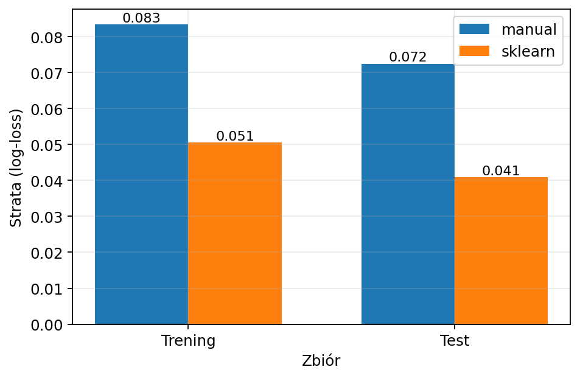
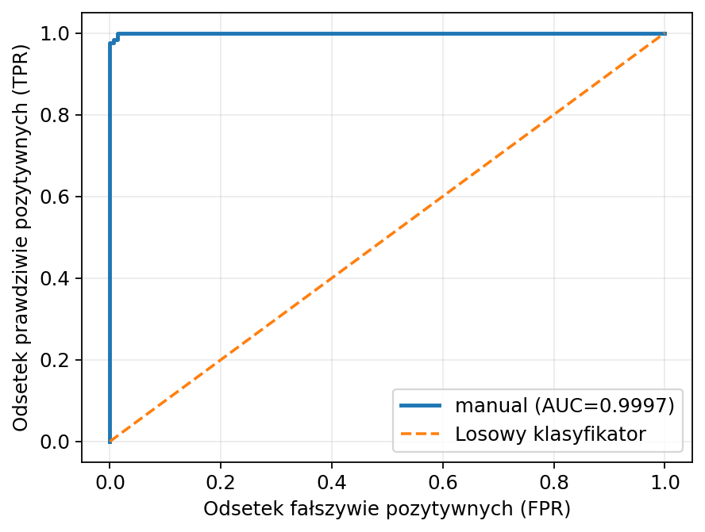
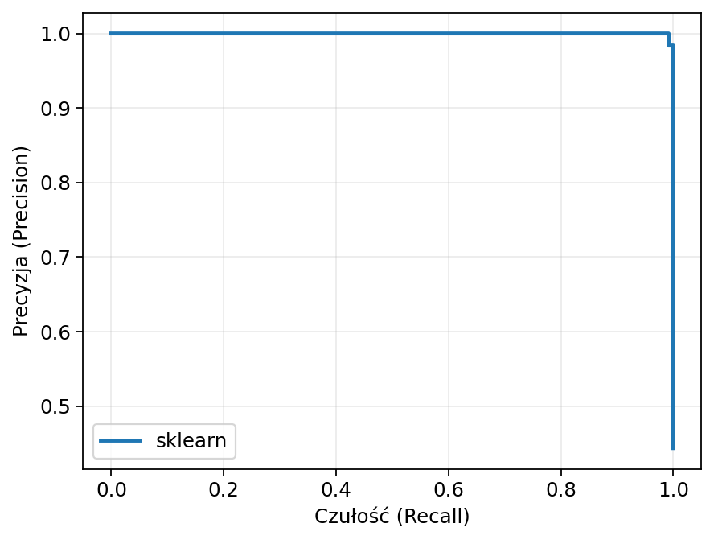
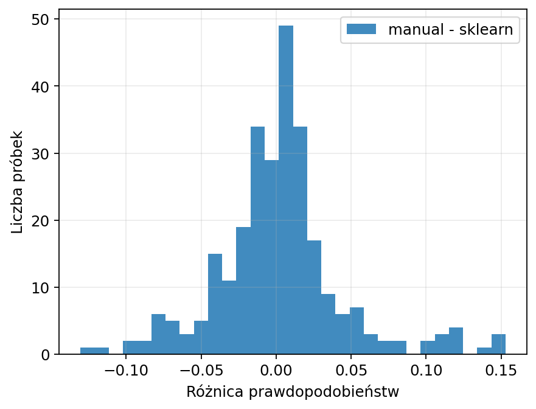

# 🧾 Banknote Authentication — Logistic Regression <br> Manual GD vs scikit-learn

**Binary classification** on the **Banknote Authentication** dataset, comparing:
- ✅ **Manual Logistic Regression (from scratch)** trained with **batch Gradient Descent**
- ✅ **scikit-learn `LogisticRegression`** as a reference baseline

📄 **Report (PDF):** [Report.pdf](Report.pdf)  
📊 **Outputs:** plots + `summary.json` saved automatically under `runs/...`

---

## 🎯 Goal
This project answers:
- How close can a **manual implementation** get to a library solution?
- Do both models achieve similar **classification quality** and **probability estimates** (log-loss / calibration)?
- How do **learned weights** compare between implementations?

---

## 🌿 Dataset (Banknote Authentication)
- **Samples:** 1372  
- **Features:** 4 (`variance`, `skewness`, `curtosis`, `entropy`)  
- **Target:** binary class (0/1)

Source (UCI):  
https://archive.ics.uci.edu/ml/machine-learning-databases/00267/data_banknote_authentication.txt

> The script auto-downloads the dataset if needed.

---

## 🧠 Models

### 🔹 Manual Logistic Regression (from scratch)
- sigmoid activation
- **binary cross-entropy (log-loss)**
- **batch gradient descent**
- threshold-based classification (`threshold = 0.5`)
- optional L2 regularization (in this snapshot: `l2 = 0.0`)

### 🔹 scikit-learn LogisticRegression
- `sklearn.linear_model.LogisticRegression`
- used as a reference model for comparison
- additional weights comparison with very large `C` (to minimize regularization effects)

---

## ⚙️ Experiment setup (snapshot)
- Train/test split: **80/20**
- Seed: **123**
- Manual learning rate: **0.05**
- Manual epochs: **2000**
- Manual L2: **0.0**
- Threshold: **0.5**

---

## 📊 Results

### Test set (main comparison)

| Model   | Accuracy | Precision | Recall | F1     | Log-loss | ROC AUC |
|---------|----------|-----------|--------|--------|----------|---------|
| manual  | 0.9927   | 0.9839    | 1.0000 | 0.9919 | 0.0725   | 0.9997  |
| sklearn | 0.9927   | 0.9839    | 1.0000 | 0.9919 | 0.0409   | 0.9999  |

**Confusion matrix (test, threshold = 0.5)**  
TN=151, FP=2, FN=0, TP=122

✅ Both models classify almost identically at threshold 0.5 (same confusion matrix),  
but **sklearn achieves lower log-loss** → typically meaning better-calibrated probabilities / stronger confidence on correct predictions.

---

### Train set (for reference)

| Model   | Accuracy | Precision | Recall | F1     | Log-loss | ROC AUC |
|---------|----------|-----------|--------|--------|----------|---------|
| manual  | 0.9745   | 0.9510    | 0.9939 | 0.9719 | 0.0835   | 0.9992  |
| sklearn | 0.9790   | 0.9586    | 0.9959 | 0.9769 | 0.0506   | 0.9996  |

---

## 📊 Visualizations (key plots)

### Loss (manual) + log-loss comparison
<p align="center">
  
  
</p>

**Left:** Manual training curve — log-loss decreases over epochs (convergence of Gradient Descent).  
**Right:** Log-loss comparison for train/test — scikit-learn achieves lower log-loss (better probability calibration), while accuracy remains the same.

---

### Confusion matrices (manual vs sklearn)
<p align="center">
  
  
</p>

Confusion matrices on the **test set** (`threshold = 0.5`).  
Both models produce the same classification outcome: **TN=151, FP=2, FN=0, TP=122**.

---

### ROC curves (manual vs sklearn)
<p align="center">
  
  
</p>

ROC curves (TPR vs FPR).  
Both models are near-perfect (**AUC ≈ 1.0**), showing excellent separability of the two classes.

---

### Precision–Recall (manual vs sklearn)
<p align="center">
  
  
</p>

Precision–Recall curves.  
High precision is maintained across almost the full recall range, confirming strong performance on the positive class.

---

### Probability comparison (test)
<p align="center">
  
  
</p>

**Left:** Scatter plot of predicted probabilities (`manual` vs `sklearn`) on the test set.  
The dashed diagonal line shows the ideal case (`manual = sklearn`).  
**Right:** Histogram of probability differences (`manual − sklearn`).  
Most differences are close to 0 → models are highly consistent, with small calibration shifts.

---

### Feature weights (normalized)
<p align="center">
  
</p>

Normalized feature weights learned by both models.  
Signs and relative magnitudes are similar, meaning both implementations learn a comparable decision boundary (minor differences come from optimization details / regularization).

---

## 📂 Output files
Each run creates a timestamped folder under `runs/` with:
- `summary.json` — parameters + metrics (train/test)
- `plots/` — generated figures (`.png`)

Example:
```text
.
├─ main.py
├─ README.md
├─ Report.pdf
└─ runs/
   └─ YYYYMMDD_HHMMSS/
      ├─ summary.json
      └─ plots/
         ├─ cm_manual.png
         ├─ cm_sklearn.png
         ├─ loss_manual.png
         ├─ loss_porownanie.png
         ├─ roc_manual.png
         ├─ roc_sklearn.png
         ├─ pr_manual.png
         ├─ pr_sklearn.png
         ├─ proba_scatter.png
         ├─ proba_diff_hist.png
         └─ wagi_porownanie.png
```

## ▶️ Running the project

Install dependencies:  
`pip install numpy scikit-learn matplotlib`

Run:  
`python main.py`

Outputs will be saved under:  
`runs/<timestamp>/`

> Note: The script uses `matplotlib.use("Agg")`, so plots are saved to files (no GUI window).


---


---

### 🧑‍💻 Author 
Created by Avuii
